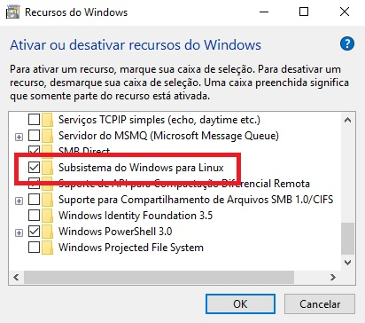

# Instalação do Docker no Windows

## 1 - Preparação: Instalação do Linux no Windows

### 1.1 - Acessar no Windows a opção "Ativar ou desativar recursos do Windows" ou, em inglês, "Turn Windows features on and off".


### 1.2 - Ativar as opções "Hyper-V" e "Subsistema do Windows para Linux"
\


### 1.3 - Após marcar esta opção, reinicie o computador.

### 1.4 - Habilitar recursos de Máquina Virtual

Inicie o Windows Powershell com direitos administrativos e rode o seguinte comando:
```
dism.exe /online /enable-feature /featurename:VirtualMachinePlatform /all /norestart
```

### 1.5 - Baixar e instalar a atualização de Kernel para Linux:

https://wslstorestorage.blob.core.windows.net/wslblob/wsl_update_x64.msi

### 1.6 - Setar o WSL2 como versão padrão

Inicie o Windows Powershell com direitos administrativos e rode o seguinte comando:
```
wsl --set-default-version 2
```

### 1.7 - Instalar o Ubuntu for Windows
```
wsl --install -d Ubuntu
```

### 1.8 - Conferindo a instalação

Execute no powershell do windows o comando:
```
wsl -l -v
```

Deverá exibir uma mensagem similiar a:

```
  NAME      STATE           VERSION
* Ubuntu    Running         2
```

## 2 - Instalando o Docker

### 2.1 - Preparando o repositório

Já dentro do terminal do container, executar os seguintes comandos, um após o outro, seguindo esta ordem:
```
sudo apt update
```
```
sudo apt install --no-install-recommends apt-transport-https ca-certificates curl gnupg2
```
```
source /etc/os-release
```
```
curl -fsSL https://download.docker.com/linux/${ID}/gpg | sudo apt-key add -
```
```
echo "deb [arch=amd64] https://download.docker.com/linux/${ID} ${VERSION_CODENAME} stable" | sudo tee /etc/apt/sources.list.d/docker.list
```


### 2.2 - Instalar a engine do Docker

Ainda dentro do terminal do container, executar os seguintes comandos, um após o outro, seguindo esta ordem:

```
sudo apt update
```
```
sudo apt install docker-ce docker-ce-cli containerd.io docker-compose-plugin
```
```
sudo service docker start
```

#### 2.3 - Verificação

Executar o comando:
```
sudo docker ps -a
```

Caso tenha tudo dado certo, será exibido uma listagem vazia dos conteiners em execução, similar a:

CONTAINER ID   IMAGE     COMMAND   CREATED   STATUS    PORTS     NAMES
