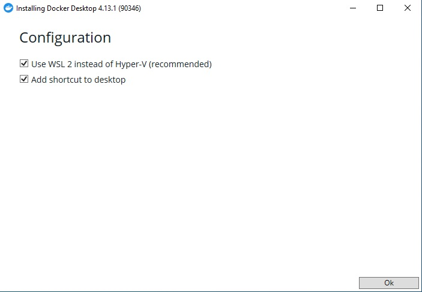
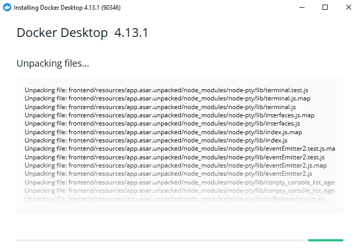

# Passo a passo para instalação do Docker for Windows

### 1 - Baixar o docker
Baixe o docker no endereço: https://www.docker.com/

### 2 - Instalando

#### 2.1 Certifique-se de que as caixas abaixo estão marcadas e clique em Ok.

#### 2.2 Aguarde a instalação terminar.

